# AMPEL360 EXLC Governance Architecture

## Comprehensive Lifecycle Governance & RACI Structure

This diagram visualizes the complete AMPEL360 Extended Lifecycle (EXLC) governance structure, showing all stages, substages, audiences, and artefact responsibilities.

---

## EXLC Overview Diagram

```mermaid
graph TB
    subgraph AMPEL360_EXLC[AMPEL360 Extended Lifecycle]
        subgraph LC1[LC-1 DEVELOPMENT]
            LC11[LC-11<br/>Research & Concept]
            LC12[LC-12<br/>Safety Analysis]
            LC13[LC-13<br/>Requirements]
            LC14[LC-14<br/>Design]
            LC15[LC-15<br/>Interfaces]
            LC16[LC-16<br/>Analysis]
            LC17[LC-17<br/>Verification]
        end
        
        subgraph LC2[LC-2 MANUFACTURING]
            LC21[LC-21<br/>Prototyping]
            LC22[LC-22<br/>Test & Cert]
            LC23[LC-23<br/>FAL & Production]
            LC24[LC-24<br/>Supply Chain]
        end
        
        subgraph LC3[LC-3 OPERATIONS / CAOS]
            LC31[LC-31<br/>Configuration]
            LC32[LC-32<br/>MRO]
            LC33[LC-33<br/>Customer Support]
            LC34[LC-34<br/>Spares & Circularity]
        end
    end
    
    LC11 --> LC12
    LC12 --> LC13
    LC13 --> LC14
    LC14 --> LC15
    LC15 --> LC16
    LC16 --> LC17
    LC17 --> LC21
    LC21 --> LC22
    LC22 --> LC23
    LC23 --> LC24
    LC24 --> LC31
    LC31 --> LC32
    LC32 --> LC33
    LC33 --> LC34
    
    style LC1 fill:#e1f5ff,stroke:#0066cc,stroke-width:3px
    style LC2 fill:#fff4e1,stroke:#cc6600,stroke-width:3px
    style LC3 fill:#e8f5e9,stroke:#00cc66,stroke-width:3px
```

---

## LC-1 Development — Detailed Governance

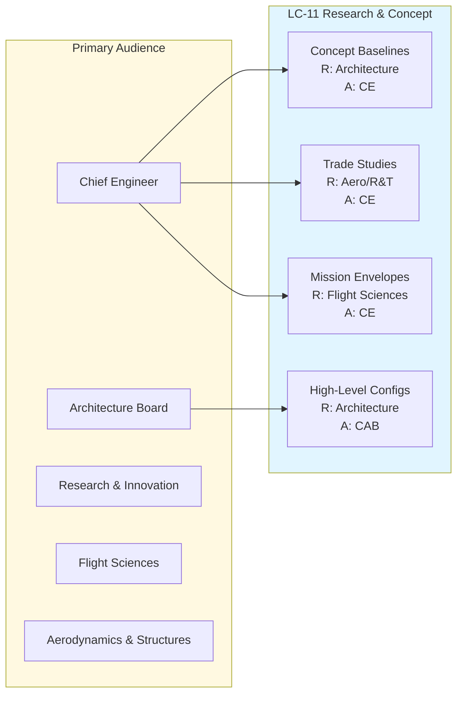
```mermaid
graph LR
    subgraph LC11_Detail[LC-11 Research & Concept]
        LC11_A1[Concept Baselines<br/>R: Architecture<br/>A: CE]
        LC11_A2[Trade Studies<br/>R: Aero/R&T<br/>A: CE]
        LC11_A3[High-Level Configs<br/>R: Architecture<br/>A: CAB]
        LC11_A4[Mission Envelopes<br/>R: Flight Sciences<br/>A: CE]
    end
    
    subgraph LC11_Audience[Primary Audience]
        LC11_CE[Chief Engineer]
        LC11_CAB[Architecture Board]
        LC11_RES[Research & Innovation]
        LC11_FS[Flight Sciences]
        LC11_AERO[Aerodynamics & Structures]
    end
    
    LC11_CE --> LC11_A1
    LC11_CE --> LC11_A2
    LC11_CAB --> LC11_A3
    LC11_CE --> LC11_A4
    
    style LC11_Detail fill:#e1f5ff
    style LC11_Audience fill:#fff9e1
```

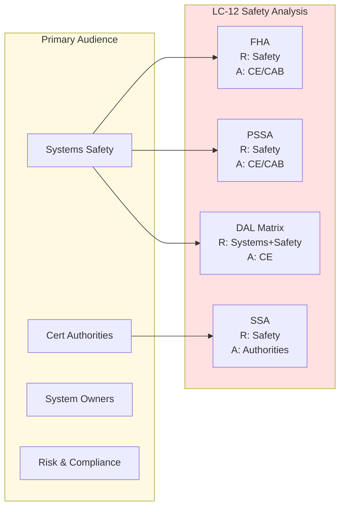
```mermaid
graph LR
    subgraph LC12_Detail[LC-12 Safety Analysis]
        LC12_A1[FHA<br/>R: Safety<br/>A: CE/CAB]
        LC12_A2[PSSA<br/>R: Safety<br/>A: CE/CAB]
        LC12_A3[SSA<br/>R: Safety<br/>A: Authorities]
        LC12_A4[DAL Matrix<br/>R: Systems+Safety<br/>A: CE]
    end
    
    subgraph LC12_Audience[Primary Audience]
        LC12_SAFE[Systems Safety]
        LC12_AUTH[Cert Authorities]
        LC12_SYS[System Owners]
        LC12_RISK[Risk & Compliance]
    end
    
    LC12_SAFE --> LC12_A1
    LC12_SAFE --> LC12_A2
    LC12_AUTH --> LC12_A3
    LC12_SAFE --> LC12_A4
    
    style LC12_Detail fill:#ffe1e1
    style LC12_Audience fill:#fff9e1
```

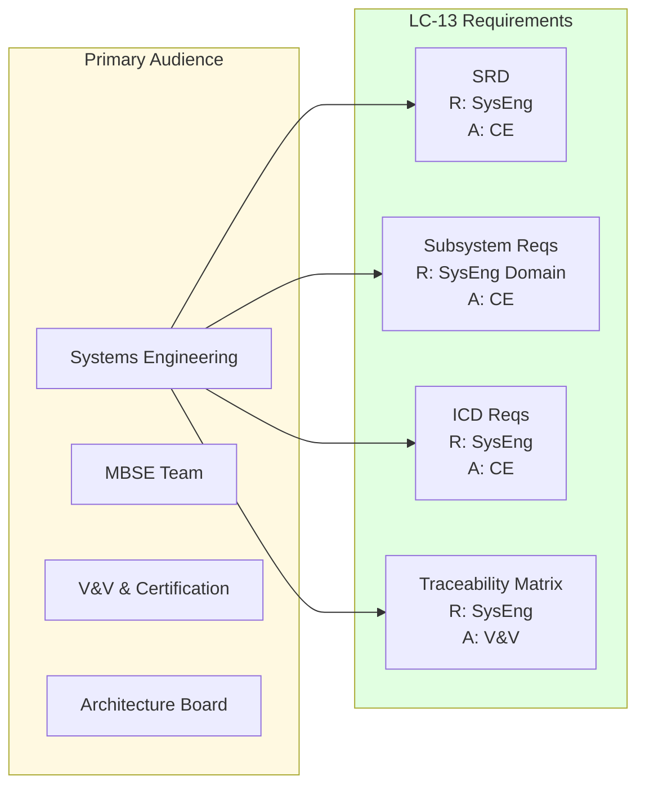
```mermaid
graph LR
    subgraph LC13_Detail[LC-13 Requirements]
        LC13_A1[SRD<br/>R: SysEng<br/>A: CE]
        LC13_A2[Subsystem Reqs<br/>R: SysEng Domain<br/>A: CE]
        LC13_A3[ICD Reqs<br/>R: SysEng<br/>A: CE]
        LC13_A4[Traceability Matrix<br/>R: SysEng<br/>A: V&V]
    end
    
    subgraph LC13_Audience[Primary Audience]
        LC13_SYSENG[Systems Engineering]
        LC13_MBSE[MBSE Team]
        LC13_VV[V&V & Certification]
        LC13_CAB[Architecture Board]
    end
    
    LC13_SYSENG --> LC13_A1
    LC13_SYSENG --> LC13_A2
    LC13_SYSENG --> LC13_A3
    LC13_SYSENG --> LC13_A4
    
    style LC13_Detail fill:#e1ffe1
    style LC13_Audience fill:#fff9e1
```

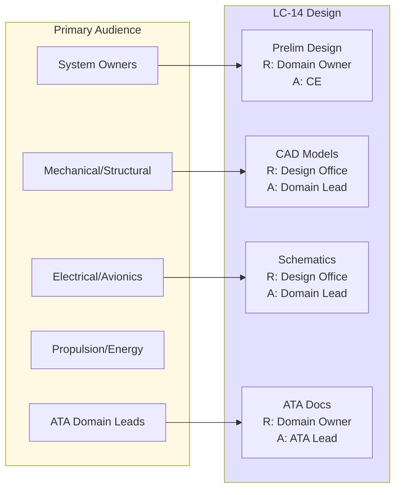
```mermaid
graph LR
    subgraph LC14_Detail[LC-14 Design]
        LC14_A1[Prelim Design<br/>R: Domain Owner<br/>A: CE]
        LC14_A2[CAD Models<br/>R: Design Office<br/>A: Domain Lead]
        LC14_A3[Schematics<br/>R: Design Office<br/>A: Domain Lead]
        LC14_A4[ATA Docs<br/>R: Domain Owner<br/>A: ATA Lead]
    end
    
    subgraph LC14_Audience[Primary Audience]
        LC14_OWNERS[System Owners]
        LC14_MECH[Mechanical/Structural]
        LC14_ELEC[Electrical/Avionics]
        LC14_PROP[Propulsion/Energy]
        LC14_ATA[ATA Domain Leads]
    end
    
    LC14_OWNERS --> LC14_A1
    LC14_MECH --> LC14_A2
    LC14_ELEC --> LC14_A3
    LC14_ATA --> LC14_A4
    
    style LC14_Detail fill:#e1e1ff
    style LC14_Audience fill:#fff9e1
```

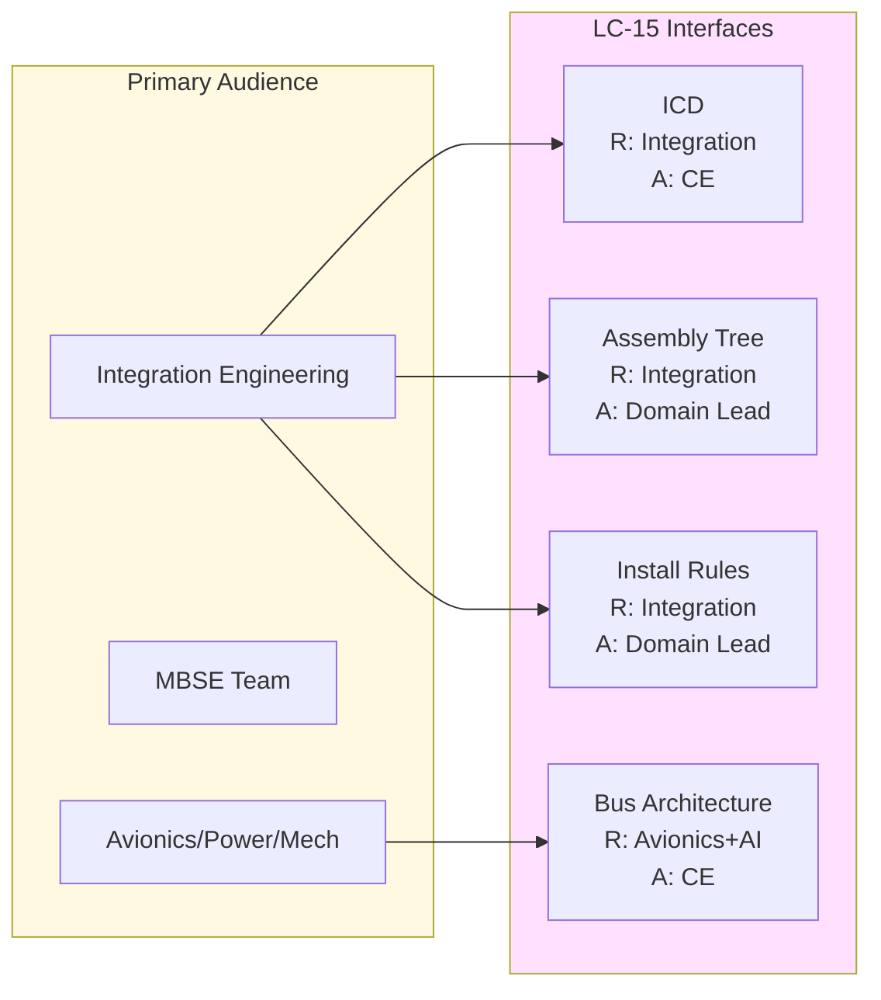
```mermaid
graph LR
    subgraph LC15_Detail[LC-15 Interfaces]
        LC15_A1[ICD<br/>R: Integration<br/>A: CE]
        LC15_A2[Assembly Tree<br/>R: Integration<br/>A: Domain Lead]
        LC15_A3[Bus Architecture<br/>R: Avionics+AI<br/>A: CE]
        LC15_A4[Install Rules<br/>R: Integration<br/>A: Domain Lead]
    end
    
    subgraph LC15_Audience[Primary Audience]
        LC15_INT[Integration Engineering]
        LC15_MBSE[MBSE Team]
        LC15_AVI[Avionics/Power/Mech]
    end
    
    LC15_INT --> LC15_A1
    LC15_INT --> LC15_A2
    LC15_AVI --> LC15_A3
    LC15_INT --> LC15_A4
    
    style LC15_Detail fill:#ffe1ff
    style LC15_Audience fill:#fff9e1
```

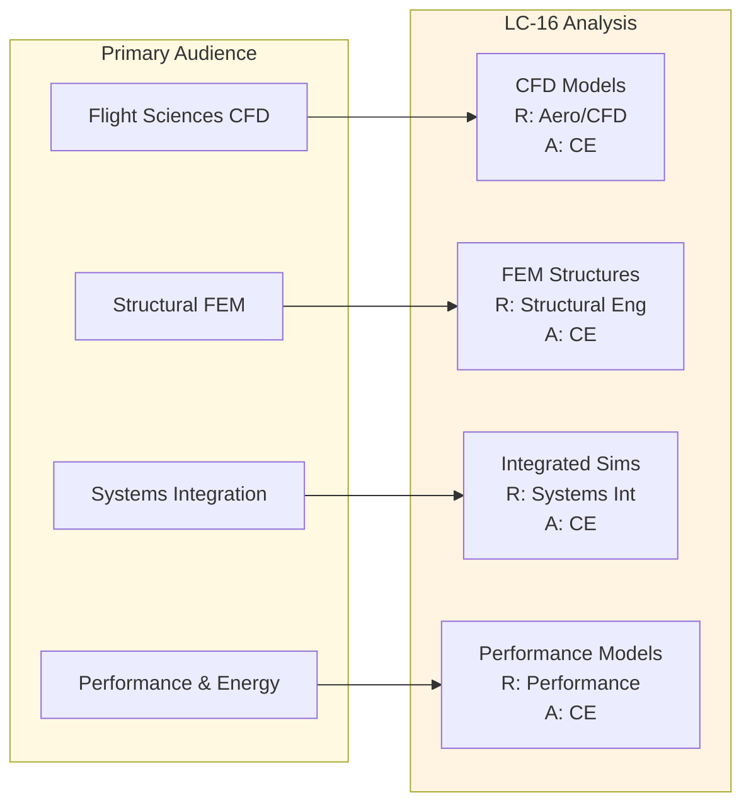
```mermaid
graph LR
    subgraph LC16_Detail[LC-16 Analysis]
        LC16_A1[CFD Models<br/>R: Aero/CFD<br/>A: CE]
        LC16_A2[FEM Structures<br/>R: Structural Eng<br/>A: CE]
        LC16_A3[Integrated Sims<br/>R: Systems Int<br/>A: CE]
        LC16_A4[Performance Models<br/>R: Performance<br/>A: CE]
    end
    
    subgraph LC16_Audience[Primary Audience]
        LC16_AERO[Flight Sciences CFD]
        LC16_STRUCT[Structural FEM]
        LC16_INT[Systems Integration]
        LC16_PERF[Performance & Energy]
    end
    
    LC16_AERO --> LC16_A1
    LC16_STRUCT --> LC16_A2
    LC16_INT --> LC16_A3
    LC16_PERF --> LC16_A4
    
    style LC16_Detail fill:#fff4e1
    style LC16_Audience fill:#fff9e1
```

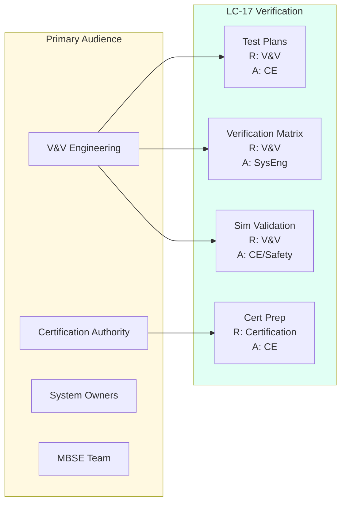
```mermaid
graph LR
    subgraph LC17_Detail[LC-17 Verification]
        LC17_A1[Test Plans<br/>R: V&V<br/>A: CE]
        LC17_A2[Verification Matrix<br/>R: V&V<br/>A: SysEng]
        LC17_A3[Sim Validation<br/>R: V&V<br/>A: CE/Safety]
        LC17_A4[Cert Prep<br/>R: Certification<br/>A: CE]
    end
    
    subgraph LC17_Audience[Primary Audience]
        LC17_VV[V&V Engineering]
        LC17_AUTH[Certification Authority]
        LC17_OWNERS[System Owners]
        LC17_MBSE[MBSE Team]
    end
    
    LC17_VV --> LC17_A1
    LC17_VV --> LC17_A2
    LC17_VV --> LC17_A3
    LC17_AUTH --> LC17_A4
    
    style LC17_Detail fill:#e1fff4
    style LC17_Audience fill:#fff9e1
```

---

## LC-2 Manufacturing — Detailed Governance

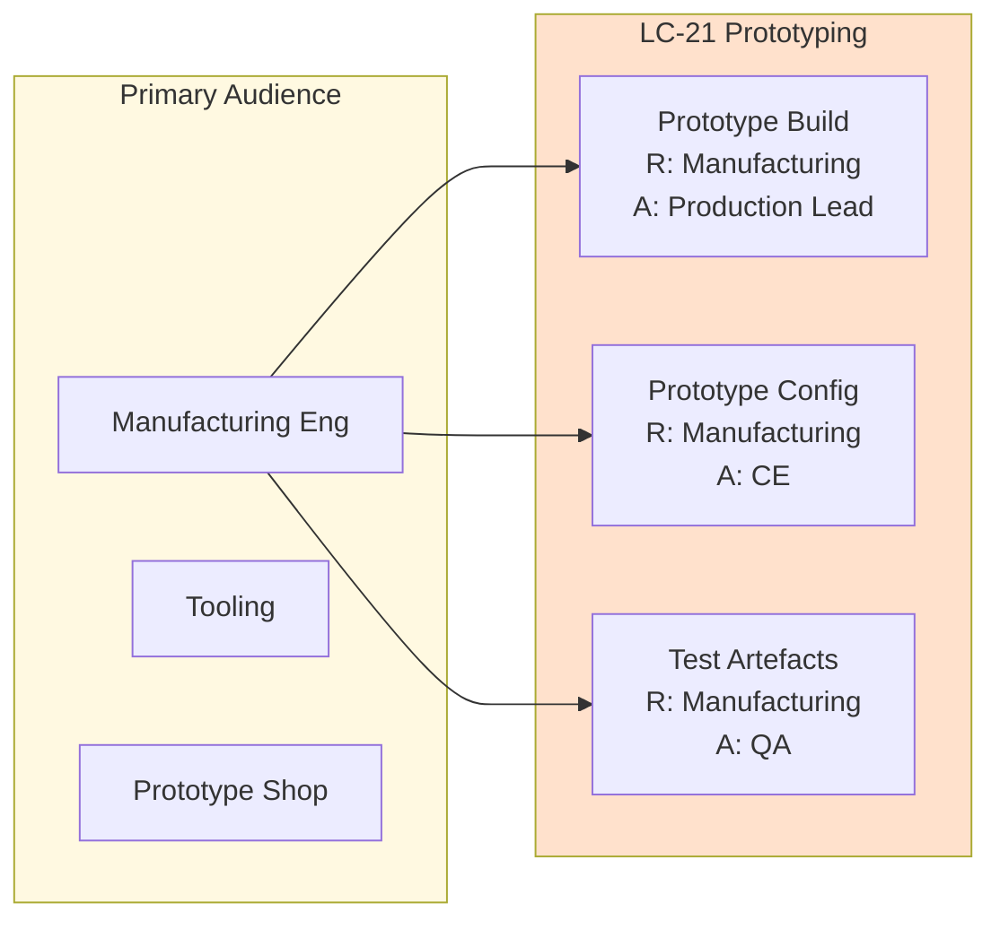
```mermaid
graph LR
    subgraph LC21_Detail[LC-21 Prototyping]
        LC21_A1[Prototype Build<br/>R: Manufacturing<br/>A: Production Lead]
        LC21_A2[Prototype Config<br/>R: Manufacturing<br/>A: CE]
        LC21_A3[Test Artefacts<br/>R: Manufacturing<br/>A: QA]
    end
    
    subgraph LC21_Audience[Primary Audience]
        LC21_MFG[Manufacturing Eng]
        LC21_TOOL[Tooling]
        LC21_PROTO[Prototype Shop]
    end
    
    LC21_MFG --> LC21_A1
    LC21_MFG --> LC21_A2
    LC21_MFG --> LC21_A3
    
    style LC21_Detail fill:#ffe1cc
    style LC21_Audience fill:#fff9e1
```

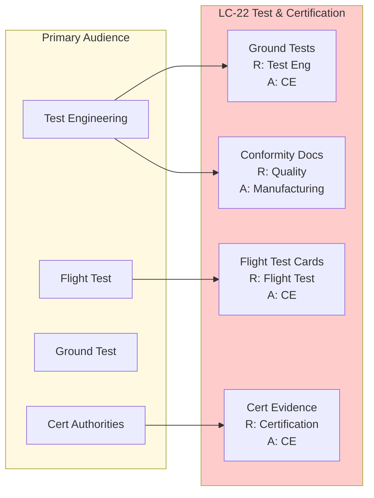
```mermaid
graph LR
    subgraph LC22_Detail[LC-22 Test & Certification]
        LC22_A1[Ground Tests<br/>R: Test Eng<br/>A: CE]
        LC22_A2[Flight Test Cards<br/>R: Flight Test<br/>A: CE]
        LC22_A3[Cert Evidence<br/>R: Certification<br/>A: CE]
        LC22_A4[Conformity Docs<br/>R: Quality<br/>A: Manufacturing]
    end
    
    subgraph LC22_Audience[Primary Audience]
        LC22_TEST[Test Engineering]
        LC22_FT[Flight Test]
        LC22_GT[Ground Test]
        LC22_AUTH[Cert Authorities]
    end
    
    LC22_TEST --> LC22_A1
    LC22_FT --> LC22_A2
    LC22_AUTH --> LC22_A3
    LC22_TEST --> LC22_A4
    
    style LC22_Detail fill:#ffcccc
    style LC22_Audience fill:#fff9e1
```

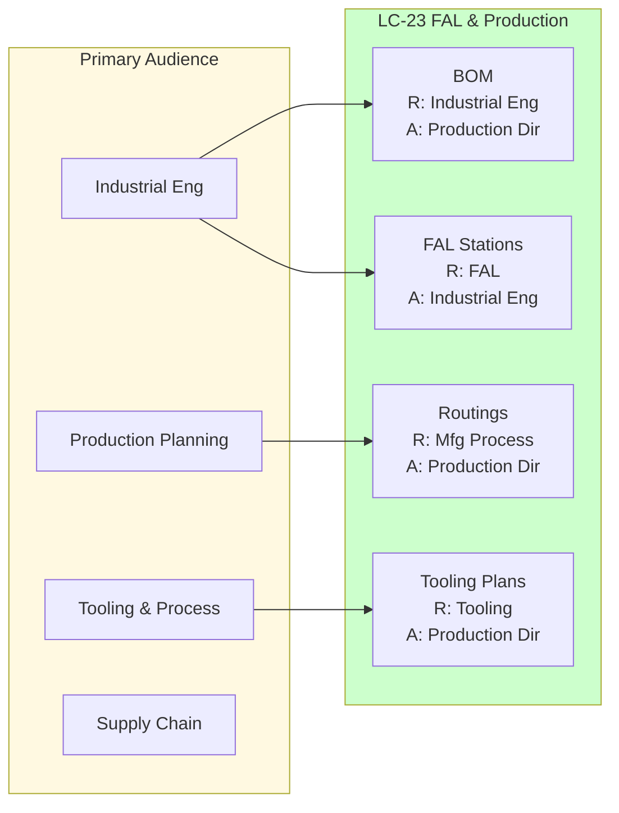
```mermaid
graph LR
    subgraph LC23_Detail[LC-23 FAL & Production]
        LC23_A1[BOM<br/>R: Industrial Eng<br/>A: Production Dir]
        LC23_A2[Routings<br/>R: Mfg Process<br/>A: Production Dir]
        LC23_A3[Tooling Plans<br/>R: Tooling<br/>A: Production Dir]
        LC23_A4[FAL Stations<br/>R: FAL<br/>A: Industrial Eng]
    end
    
    subgraph LC23_Audience[Primary Audience]
        LC23_IE[Industrial Eng]
        LC23_PP[Production Planning]
        LC23_TOOL[Tooling & Process]
        LC23_SC[Supply Chain]
    end
    
    LC23_IE --> LC23_A1
    LC23_PP --> LC23_A2
    LC23_TOOL --> LC23_A3
    LC23_IE --> LC23_A4
    
    style LC23_Detail fill:#ccffcc
    style LC23_Audience fill:#fff9e1
```

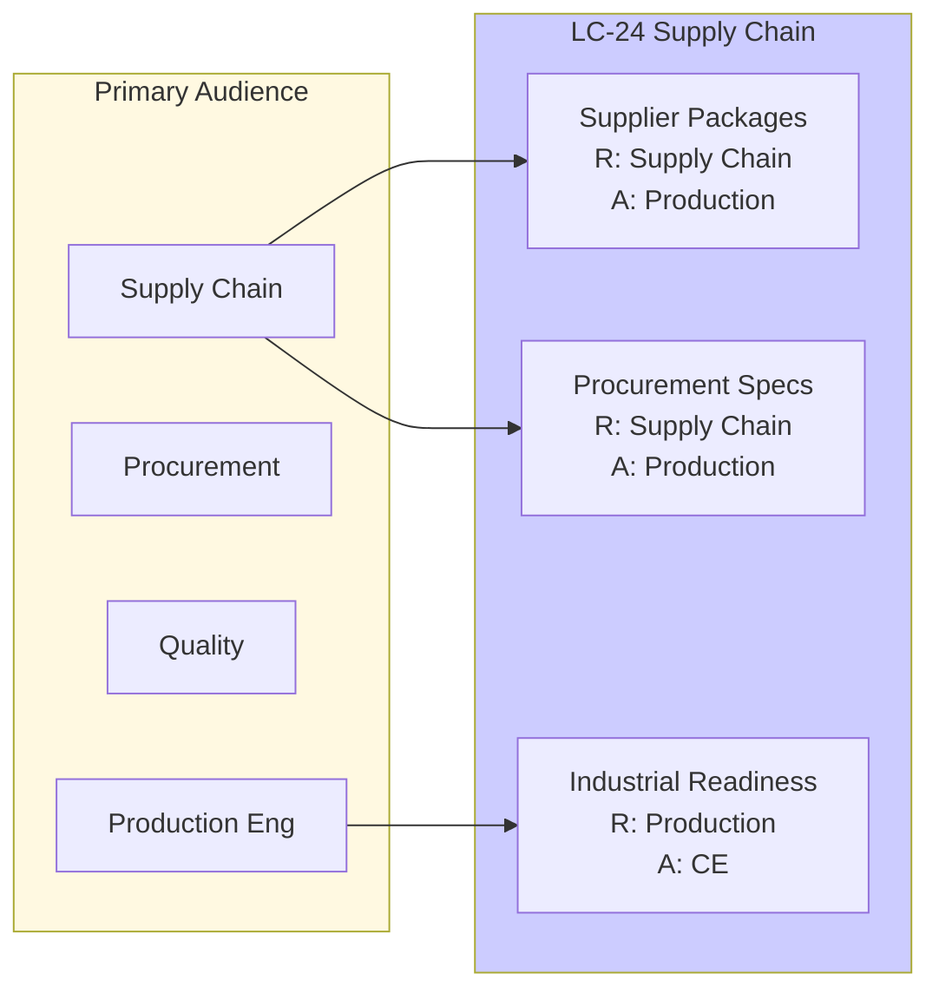
```mermaid
graph LR
    subgraph LC24_Detail[LC-24 Supply Chain]
        LC24_A1[Supplier Packages<br/>R: Supply Chain<br/>A: Production]
        LC24_A2[Procurement Specs<br/>R: Supply Chain<br/>A: Production]
        LC24_A3[Industrial Readiness<br/>R: Production<br/>A: CE]
    end
    
    subgraph LC24_Audience[Primary Audience]
        LC24_SC[Supply Chain]
        LC24_PROC[Procurement]
        LC24_QA[Quality]
        LC24_PE[Production Eng]
    end
    
    LC24_SC --> LC24_A1
    LC24_SC --> LC24_A2
    LC24_PE --> LC24_A3
    
    style LC24_Detail fill:#ccccff
    style LC24_Audience fill:#fff9e1
```

---

## LC-3 Operations / CAOS — Detailed Governance

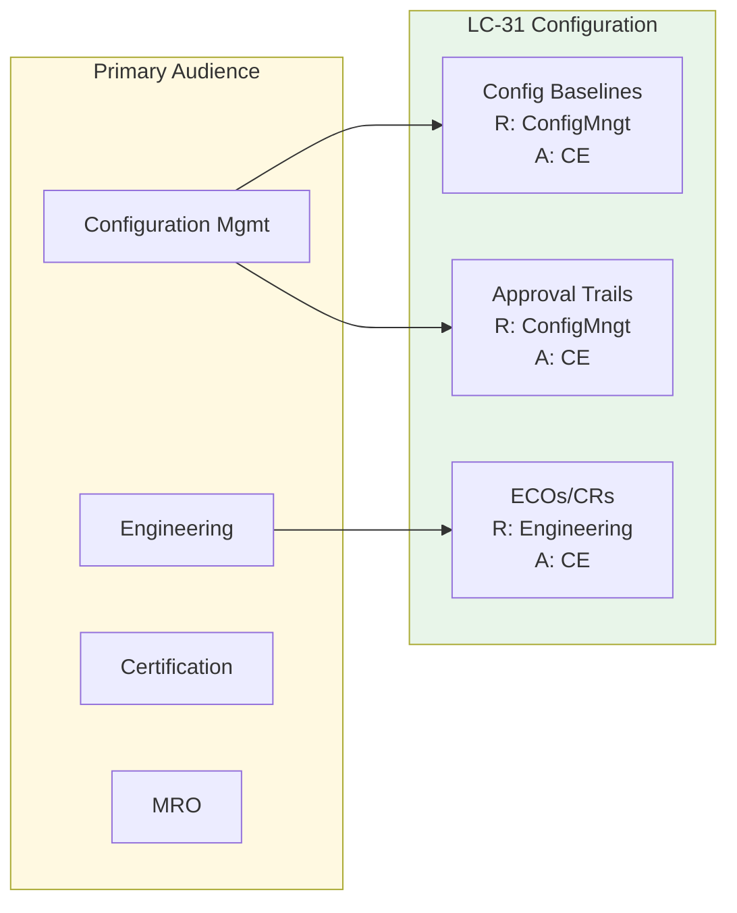
```mermaid
graph LR
    subgraph LC31_Detail[LC-31 Configuration]
        LC31_A1[Config Baselines<br/>R: ConfigMngt<br/>A: CE]
        LC31_A2[ECOs/CRs<br/>R: Engineering<br/>A: CE]
        LC31_A3[Approval Trails<br/>R: ConfigMngt<br/>A: CE]
    end
    
    subgraph LC31_Audience[Primary Audience]
        LC31_CM[Configuration Mgmt]
        LC31_ENG[Engineering]
        LC31_CERT[Certification]
        LC31_MRO[MRO]
    end
    
    LC31_CM --> LC31_A1
    LC31_ENG --> LC31_A2
    LC31_CM --> LC31_A3
    
    style LC31_Detail fill:#e8f5e9
    style LC31_Audience fill:#fff9e1
```

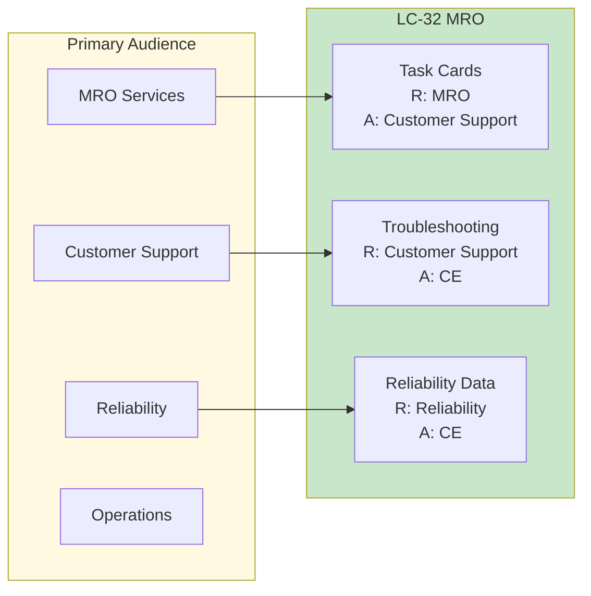
```mermaid
graph LR
    subgraph LC32_Detail[LC-32 MRO]
        LC32_A1[Task Cards<br/>R: MRO<br/>A: Customer Support]
        LC32_A2[Troubleshooting<br/>R: Customer Support<br/>A: CE]
        LC32_A3[Reliability Data<br/>R: Reliability<br/>A: CE]
    end
    
    subgraph LC32_Audience[Primary Audience]
        LC32_MRO[MRO Services]
        LC32_CS[Customer Support]
        LC32_REL[Reliability]
        LC32_OPS[Operations]
    end
    
    LC32_MRO --> LC32_A1
    LC32_CS --> LC32_A2
    LC32_REL --> LC32_A3
    
    style LC32_Detail fill:#c8e6c9
    style LC32_Audience fill:#fff9e1
```

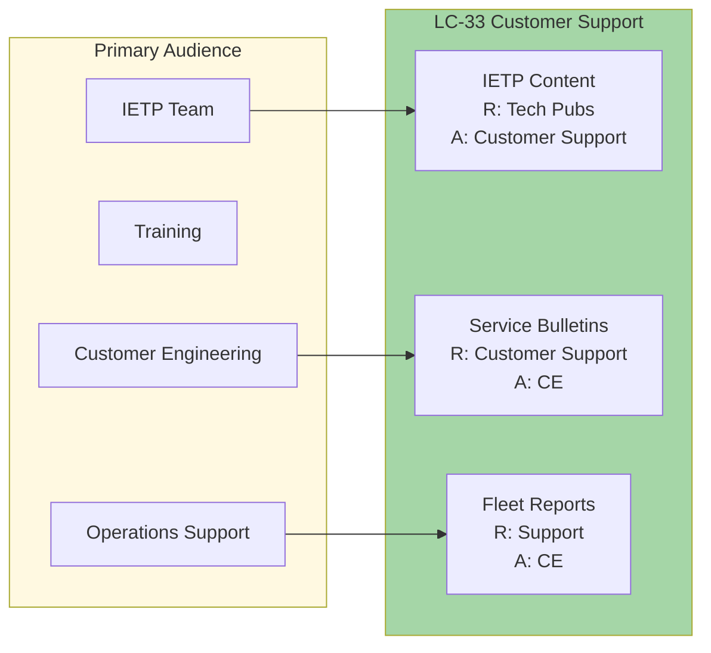
```mermaid
graph LR
    subgraph LC33_Detail[LC-33 Customer Support]
        LC33_A1[IETP Content<br/>R: Tech Pubs<br/>A: Customer Support]
        LC33_A2[Service Bulletins<br/>R: Customer Support<br/>A: CE]
        LC33_A3[Fleet Reports<br/>R: Support<br/>A: CE]
    end
    
    subgraph LC33_Audience[Primary Audience]
        LC33_IETP[IETP Team]
        LC33_TRAIN[Training]
        LC33_OPS[Operations Support]
        LC33_CE[Customer Engineering]
    end
    
    LC33_IETP --> LC33_A1
    LC33_CE --> LC33_A2
    LC33_OPS --> LC33_A3
    
    style LC33_Detail fill:#a5d6a7
    style LC33_Audience fill:#fff9e1
```

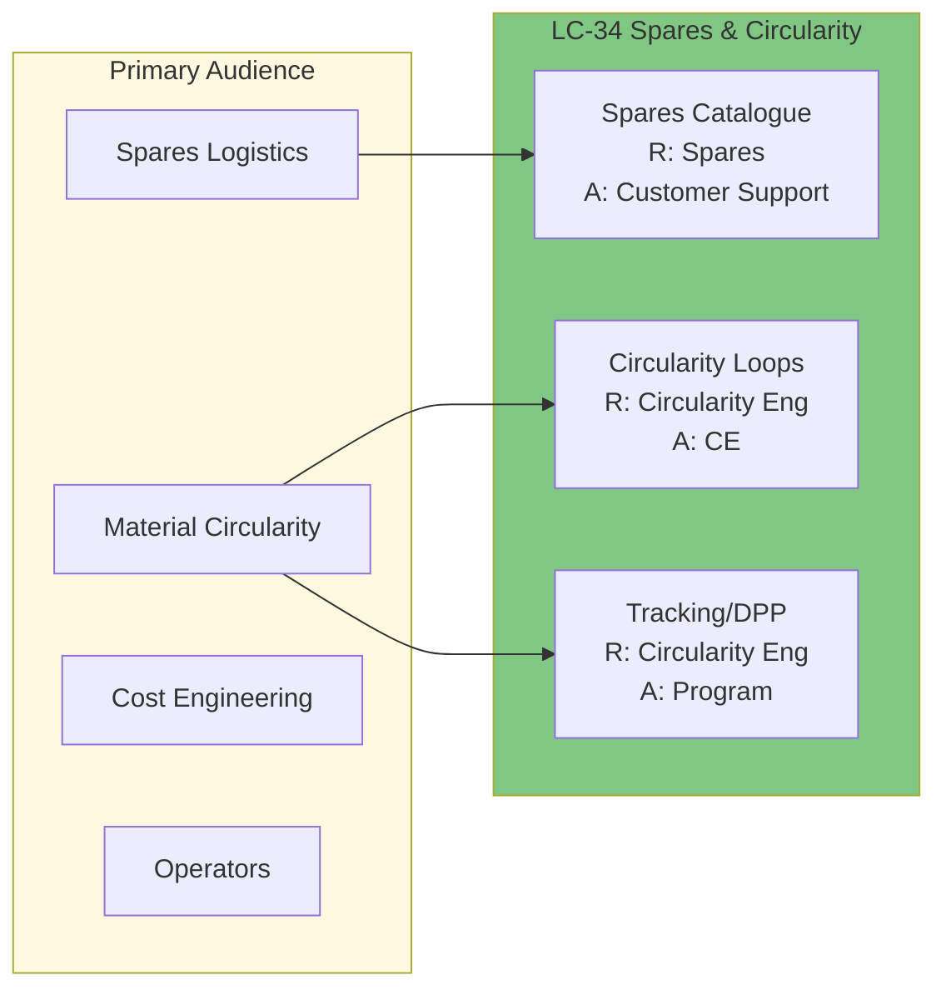
```mermaid
graph LR
    subgraph LC34_Detail[LC-34 Spares & Circularity]
        LC34_A1[Spares Catalogue<br/>R: Spares<br/>A: Customer Support]
        LC34_A2[Circularity Loops<br/>R: Circularity Eng<br/>A: CE]
        LC34_A3[Tracking/DPP<br/>R: Circularity Eng<br/>A: Program]
    end
    
    subgraph LC34_Audience[Primary Audience]
        LC34_SPARE[Spares Logistics]
        LC34_CIRC[Material Circularity]
        LC34_COST[Cost Engineering]
        LC34_OPS[Operators]
    end
    
    LC34_SPARE --> LC34_A1
    LC34_CIRC --> LC34_A2
    LC34_CIRC --> LC34_A3
    
    style LC34_Detail fill:#81c784
    style LC34_Audience fill:#fff9e1
```

---

## Cross-Lifecycle Integration

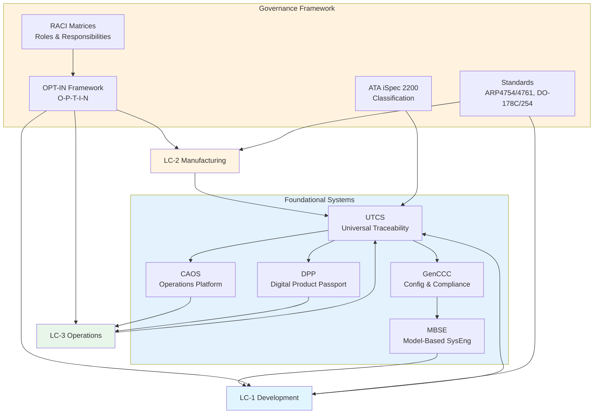
```mermaid
graph TB
    subgraph Foundations[Foundational Systems]
        UTCS[UTCS<br/>Universal Traceability]
        GenCCC[GenCCC<br/>Config & Compliance]
        MBSE[MBSE<br/>Model-Based SysEng]
        CAOS[CAOS<br/>Operations Platform]
        DPP[DPP<br/>Digital Product Passport]
    end
    
    subgraph Governance[Governance Framework]
        OPTIN[OPT-IN Framework<br/>O-P-T-I-N]
        ATA[ATA iSpec 2200<br/>Classification]
        RACI[RACI Matrices<br/>Roles & Responsibilities]
        Standards[Standards<br/>ARP4754/4761, DO-178C/254]
    end
    
    LC1[LC-1 Development] --> UTCS
    LC2[LC-2 Manufacturing] --> UTCS
    LC3[LC-3 Operations] --> UTCS
    
    UTCS --> GenCCC
    UTCS --> CAOS
    UTCS --> DPP
    
    GenCCC --> MBSE
    MBSE --> LC1
    CAOS --> LC3
    DPP --> LC3
    
    OPTIN --> LC1
    OPTIN --> LC2
    OPTIN --> LC3
    
    ATA --> UTCS
    RACI --> OPTIN
    Standards --> LC1
    Standards --> LC2
    
    style Foundations fill:#e3f2fd
    style Governance fill:#fff3e0
    style LC1 fill:#e1f5ff
    style LC2 fill:#fff4e1
    style LC3 fill:#e8f5e9
```

---

## Artefact Flow Through Lifecycle

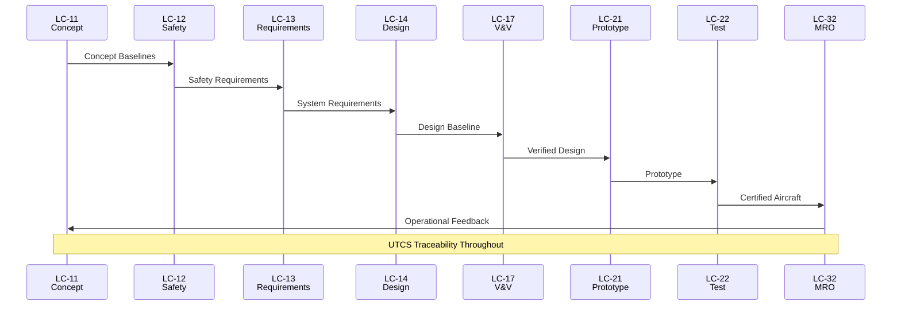
```mermaid
sequenceDiagram
    participant LC11 as LC-11<br/>Concept
    participant LC12 as LC-12<br/>Safety
    participant LC13 as LC-13<br/>Requirements
    participant LC14 as LC-14<br/>Design
    participant LC17 as LC-17<br/>V&V
    participant LC21 as LC-21<br/>Prototype
    participant LC22 as LC-22<br/>Test
    participant LC32 as LC-32<br/>MRO
    
    LC11->>LC12: Concept Baselines
    LC12->>LC13: Safety Requirements
    LC13->>LC14: System Requirements
    LC14->>LC17: Design Baseline
    LC17->>LC21: Verified Design
    LC21->>LC22: Prototype
    LC22->>LC32: Certified Aircraft
    LC32->>LC11: Operational Feedback
    
    Note over LC11,LC32: UTCS Traceability Throughout
```

---

## Decision Authority Matrix

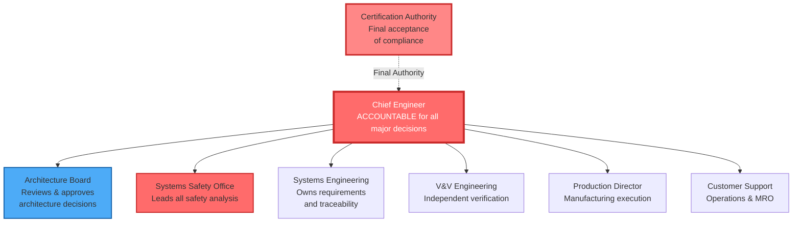
```mermaid
graph TB
    CE[Chief Engineer<br/>ACCOUNTABLE for all major decisions]
    
    CAB[Architecture Board<br/>Reviews & approves<br/>architecture decisions]
    
    SafetyOff[Systems Safety Office<br/>Leads all safety analysis]
    
    SysEng[Systems Engineering<br/>Owns requirements<br/>and traceability]
    
    VV[V&V Engineering<br/>Independent verification]
    
    CertAuth[Certification Authority<br/>Final acceptance<br/>of compliance]
    
    ProdDir[Production Director<br/>Manufacturing execution]
    
    CustSup[Customer Support<br/>Operations & MRO]
    
    CE --> CAB
    CE --> SafetyOff
    CE --> SysEng
    CE --> VV
    CE --> ProdDir
    CE --> CustSup
    
    CertAuth -.Final Authority.-> CE
    
    style CE fill:#ff6b6b,stroke:#c92a2a,stroke-width:4px,color:#fff
    style CertAuth fill:#ff8787,stroke:#c92a2a,stroke-width:3px
    style CAB fill:#4dabf7,stroke:#1864ab,stroke-width:2px
    style SafetyOff fill:#ff6b6b,stroke:#c92a2a,stroke-width:2px
```

---

## Document Control

**Version:** 1.0  
**Date:** December 2025  
**Status:** Released  
**Owner:** AMPEL360 Program Office

**Related Documents:**
- [UTCS-LC Naming Rules](./UTCS/UTCS-LC_NAMING_RULES.md)
- [AMPEL360 LC Framework](./AMPEL360_LC_FRAMEWORK.md)
- Individual RACI Matrices in each LC substage folder
